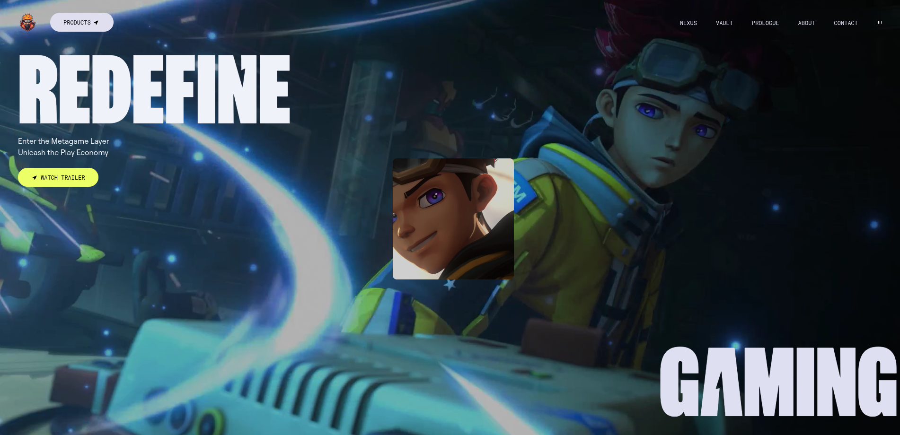

# Zentry Games 🎮⚡️

A modern anime-style landing page built with React, Vite, Tailwind CSS, and GSAP, focused on smooth animations, scroll-based interactions, and immersive UI effects.

<p align="center">
    
</p>

Live Demo: https://zentry-games-lp.vercel.app/

## ✨ Features

- Beautiful anime-style hero & bento grid
- Scroll-triggered & mouse-follow animations (GSAP)
- 3D tilt & hover effects
- Responsive design
- Modern React stack with great DX

## 🛠️ Tech Stack

- React 19 + TypeScript
- Vite
- Tailwind CSS
- GSAP (core animations)
- shadcn/ui components
- Biome (lint + formatter)
- pnpm

## 🚀 Quick Start

```bash
# Clone the repo
git clone git@github.com:Mirian97/zentry-games-gsap.git

# Go to project folder
cd anime-landing-page-gsap

# Install dependencies
pnpm install

# Start development server
pnpm dev
```
